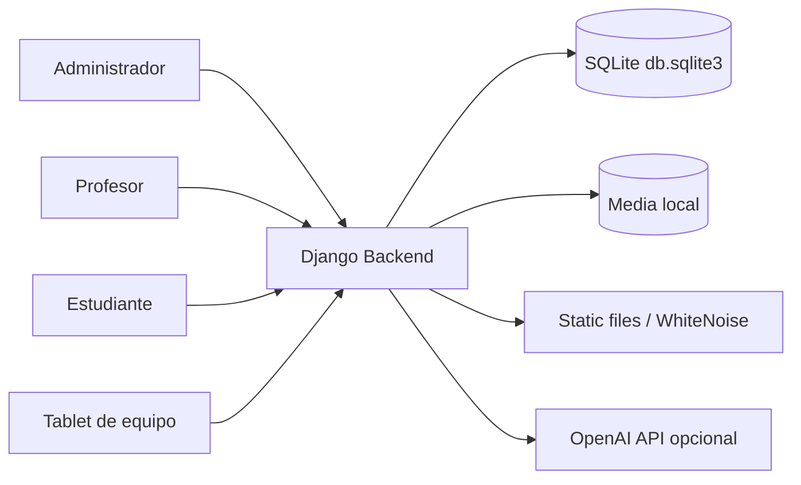
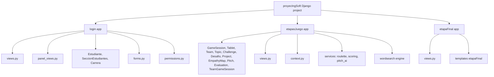
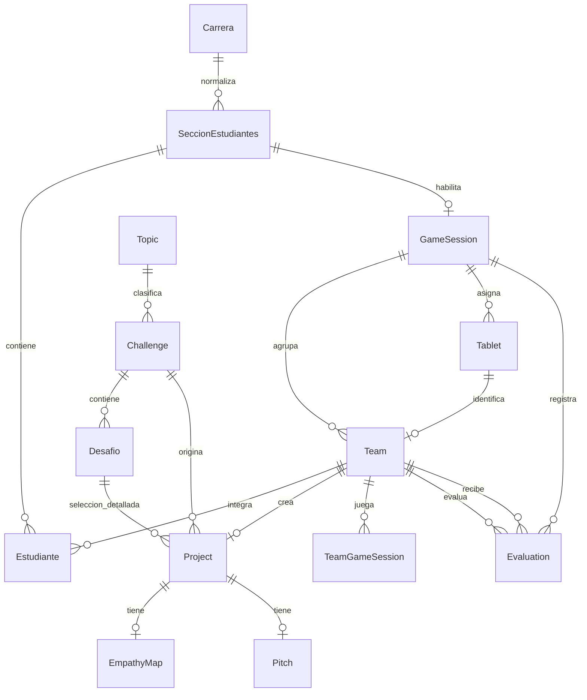
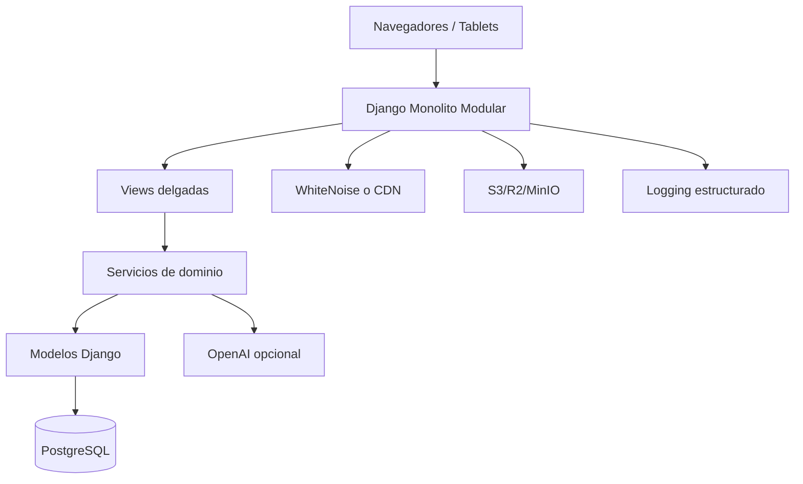

# Arquitectura del Sistema Backend

## 1. Proposito del Documento

Este documento describe la arquitectura backend actual del proyecto **Mision Emprende**, una aplicacion web Django orientada a gestionar una experiencia ludica por etapas para estudiantes, profesores, administradores y tablets compartidas. El objetivo es dejar una vision tecnica clara del sistema, sus componentes, decisiones arquitectonicas, flujos principales, riesgos, ventajas, desventajas y propuestas de mejora fundamentadas.

El analisis se basa en la estructura y codigo existentes del repositorio, especialmente:

- `proyecIngSoft/proyecIngSoft/settings.py`
- `proyecIngSoft/proyecIngSoft/urls.py`
- `proyecIngSoft/login/`
- `proyecIngSoft/etapasJuego/`
- `proyecIngSoft/etapaFinal/`
- `proyecIngSoft/requirements.txt`
- `proyecIngSoft/Dockerfile`
- `proyecIngSoft/docker-compose.yml`
- `specs/001-rompehielo-ruleta/plan.md`

## 2. Resumen Ejecutivo

El backend esta construido como una aplicacion web monolitica modular basada en **Django 5.2.7**. La arquitectura combina renderizado server-side mediante templates Django con endpoints JSON puntuales para interacciones dinamicas del juego, como la sopa de letras, la ruleta de rompehielo, el guardado de mapas de empatia, el pitch y la coevaluacion.

La solucion esta organizada en tres apps principales:

- `login`: autenticacion, ingreso por tipo de usuario, administracion de estudiantes, secciones, profesores, sesiones, equipos, tablets, temas y desafios.
- `etapasJuego`: nucleo del flujo ludico por etapas, modelos de dominio del juego, APIs de interaccion, servicios de scoring, ruleta e integracion con OpenAI.
- `etapaFinal`: coevaluacion, resultados finales, ranking y carga de foto grupal.

La persistencia actual esta configurada con **SQLite** (`db.sqlite3`) y almacenamiento local de archivos en `MEDIA_ROOT`. La aplicacion puede ejecutarse mediante Docker y expone el puerto `8000`. Para archivos estaticos se usa WhiteNoise con almacenamiento comprimido y manifestado.

Arquitectonicamente, el proyecto es adecuado para un prototipo funcional, demo academica o despliegue de baja concurrencia. Sin embargo, para evolucionar hacia un entorno productivo o multi-sesion robusto, se recomienda fortalecer la separacion de responsabilidades, seguridad, manejo transaccional, modelo de identidad de tablets/equipos, persistencia en PostgreSQL, observabilidad, pruebas y control de configuracion.

## 3. Alcance del Backend

El backend cubre las siguientes responsabilidades:

- Gestionar usuarios administrativos y profesores mediante autenticacion Django.
- Permitir ingreso de estudiantes y asignacion a equipos.
- Permitir ingreso de tablets mediante PIN.
- Administrar secciones, sesiones de juego, tablets, equipos, estudiantes, temas, challenges, desafios y evaluaciones.
- Mantener el estado de avance de etapas del juego.
- Generar y validar sopa de letras por equipo.
- Exponer ranking de etapa 1.
- Gestionar seleccion de tema y desafio.
- Persistir mapa de empatia, proyecto, prototipo, pitch y evaluaciones.
- Calcular tokens por categorias: empatia, creatividad, evaluacion y total.
- Integrar opcionalmente OpenAI para sugerencias y evaluacion de pitch.
- Servir templates HTML, archivos estaticos y archivos media.

Quedan fuera del backend actual:

- API REST completa versionada.
- Autenticacion tokenizada para clientes externos.
- Separacion fisica por microservicios.
- Cola de trabajos asincronos.
- Observabilidad avanzada.
- Escalamiento horizontal formal.

## 4. Contexto Tecnologico

| Categoria | Tecnologia actual |
|---|---|
| Lenguaje | Python |
| Framework backend | Django 5.2.7 |
| Renderizado | Django Templates |
| Interactividad frontend | JavaScript, CSS y HTML por template |
| Base de datos | SQLite |
| Archivos estaticos | Django staticfiles + WhiteNoise |
| Archivos subidos | Sistema de archivos local en `MEDIA_ROOT` |
| IA externa | OpenAI Python SDK |
| Configuracion | Variables de entorno + `.env` mediante `python-dotenv` |
| Contenedores | Docker + docker-compose |
| Servidor WSGI previsto | Gunicorn, aunque el contenedor delega en `entrypoint.sh` |
| Testing | `django.test.TestCase` |

## 5. Estilo Arquitectonico

El sistema sigue un estilo de **monolito modular server-rendered**:

- Monolito porque todo el dominio vive en una sola aplicacion Django desplegable.
- Modular porque el codigo se separa por apps Django (`login`, `etapasJuego`, `etapaFinal`) y por submodulos de servicios (`services`, `wordsearch`).
- Server-rendered porque la mayoria de pantallas se entregan como HTML desde Django.
- Hibrido con endpoints JSON porque algunas interacciones del juego necesitan actualizacion dinamica sin recargar toda la pagina.

Este estilo es coherente con un producto academico o MVP: reduce complejidad operativa, facilita iteracion visual rapida y permite mantener el estado de negocio en modelos Django sin crear una API distribuida prematuramente.

## 6. Vista de Contenedores



### Componentes externos

- **Navegador web**: cliente principal para administradores, profesores, estudiantes y tablets.
- **OpenAI API**: dependencia opcional para sugerencias y evaluacion del pitch.
- **Sistema de archivos local**: almacena imagenes, videos, prototipos y fotos grupales.

## 7. Vista Logica por Modulos



## 8. Responsabilidades por App

### 8.1 `login`

Responsabilidades principales:

- Presentar el formulario de ingreso.
- Distinguir entre usuario `profesor`, `administrador`, `estudiante` y `tableta`.
- Autenticar profesores y administradores con el sistema de auth de Django.
- Validar roles mediante grupos.
- Registrar estudiantes o reutilizarlos segun modo de asignacion.
- Asignar estudiantes a equipos.
- Asociar tablets a la sesion Django mediante `tablet_id` y `team_id`.
- Entregar paneles administrativos y de profesor.

Modelos relevantes:

- `SeccionEstudiantes`: seccion academica asociable a una sesion de juego.
- `Estudiante`: participante con carrera, seccion y equipo.
- `Carrera`: catalogo normalizado de carreras.

### 8.2 `etapasJuego`

Responsabilidades principales:

- Mantener el dominio central del juego.
- Gestionar sesiones de juego (`GameSession`).
- Gestionar equipos (`Team`) y tablets (`Tablet`).
- Gestionar catalogos de temas, challenges y desafios.
- Gestionar proyectos, mapas de empatia y pitch.
- Implementar etapas de juego y sus endpoints dinamicos.
- Calcular tokens.
- Integrar IA opcional.
- Generar y validar sopa de letras.
- Exponer ruleta de rompehielo HTML y JSON.

Modelos relevantes:

- `GameSession`: sesion de juego vinculada opcionalmente a profesor y seccion.
- `Tablet`: dispositivo con codigo y PIN de acceso.
- `Team`: equipo participante con tokens y tablet asignada.
- `TeamGameSession`: estado de la sopa de letras por equipo.
- `Topic`, `Challenge`, `Desafio`: estructura tematica y narrativa de desafios.
- `Project`: proyecto creado por un equipo a partir de un challenge/desafio.
- `EmpathyMap`: respuestas del mapa de empatia.
- `Pitch`: guion, sugerencias IA y score IA.
- `Evaluation`: coevaluacion entre equipos.

Servicios relevantes:

- `services/roulette.py`: catalogo y seleccion stateless de preguntas de rompehielo.
- `services/scoring.py`: calculo de tokens por etapa y persistencia en `Team`.
- `services/pitch_ai.py`: generacion de sugerencias y evaluacion de pitch con OpenAI.
- `wordsearch/engine.py`: generacion y validacion de sopa de letras.
- `context.py`: resolucion de sesion/equipo actual segun tablet o session key.

### 8.3 `etapaFinal`

Responsabilidades principales:

- Mostrar coevaluacion para equipos.
- Guardar o actualizar coevaluaciones.
- Recalcular tokens de equipos evaluados.
- Mostrar ranking final por `tokens_totales`.
- Guardar foto grupal del proyecto.

Aunque `etapaFinal` no define modelos propios activos, reutiliza modelos de `etapasJuego`, especialmente `Evaluation`, `Team` y `Project`.

## 9. Rutas Principales

### 9.1 Rutas raiz del proyecto

| Ruta | Destino |
|---|---|
| `/` | redireccion a login |
| `/admin/` | Django Admin |
| `/login/` | app `login` |
| `/admin-panel/` | panel administrativo propio |
| `/profesor/` | panel de profesor |
| `/etapasJuego/` | flujo principal de etapas |
| `/etapa-final/` | coevaluacion y resultados |
| `/media/` | servicio directo de media desde Django |

### 9.2 Rutas de juego relevantes

| Ruta | Funcion |
|---|---|
| `/etapasJuego/tablet/seleccion-modalidad/` | seleccion previa en tablet |
| `/etapasJuego/tablet/rompehielo/` | rompehielo HTML |
| `/etapasJuego/tablet/rompehielo/?format=json` | bootstrap JSON de preguntas |
| `/etapasJuego/etapa/1/` | sopa de letras |
| `/etapasJuego/api/init/` | inicializa sopa de letras |
| `/etapasJuego/api/start/` | marca inicio de etapa 1 |
| `/etapasJuego/api/select/start/` | inicia seleccion en sopa |
| `/etapasJuego/api/select/extend/` | extiende seleccion |
| `/etapasJuego/api/select/commit/` | valida seleccion |
| `/etapasJuego/api/ranking/` | ranking JSON etapa 1 |
| `/etapasJuego/inicio-historia/` | narrativa y seleccion de escuadron/tema |
| `/etapasJuego/etapa/2/` | seleccion/listado de desafios |
| `/etapasJuego/etapa/2/seleccionar/` | persiste desafio seleccionado |
| `/etapasJuego/etapa/2/seleccion/` | mapa de empatia |
| `/etapasJuego/etapa/2/mapa/guardar/` | guarda mapa de empatia |
| `/etapasJuego/etapa/3/` | prototipo |
| `/etapasJuego/etapa/3/guardar-foto/` | guarda imagenes/resumen |
| `/etapasJuego/etapa/4/` | pitch |
| `/etapasJuego/etapa/4/guardar-pitch/` | guarda pitch y evalua IA |

## 10. Modelo de Datos Conceptual



### Observaciones sobre el modelo

- `GameSession` es el eje operativo de la experiencia.
- `Team` concentra identidad de equipo, tablet y resultados.
- `Project` representa el trabajo creativo del equipo y conecta desafio, mapa, prototipo y pitch.
- `Evaluation` se usa para coevaluacion final y afecta tokens.
- `TeamGameSession` persiste el estado de la sopa de letras con campos JSON, lo que simplifica el modelo a costa de menor normalizacion.
- `SeccionEstudiantes.carrera` convive con `carrera_fk`; esto evidencia una transicion desde texto legado hacia catalogo normalizado.

## 11. Flujos Principales

### 11.1 Ingreso de administrador/profesor

1. El usuario entra a `/login/`.
2. Selecciona tipo `profesor` o `administrador`.
3. Django valida credenciales con `AuthenticationForm` y `authenticate`.
4. Se verifica rol por grupo.
5. Se redirige a `/profesor/` o `/admin-panel/`.

Fortaleza: reutiliza autenticacion Django y grupos.

Riesgo: la autorizacion depende de decoradores y convenciones en vistas; se recomienda auditar cobertura completa de paneles y acciones.

### 11.2 Ingreso de estudiante

1. El estudiante ingresa nombre, carrera y seccion.
2. El sistema busca una `GameSession` asociada a la seccion.
3. Segun `modo_asignacion`, asigna automaticamente un equipo o valida una asignacion preconfigurada.
4. Redirige a pantalla de estudiante ingresado.

Fortaleza: facilita experiencias de aula con baja friccion.

Riesgo: en modo automatico la asignacion de equipos no esta protegida explicitamente con transacciones, por lo que bajo concurrencia podria asignar de forma inconsistente.

### 11.3 Ingreso de tablet

1. La tablet ingresa PIN.
2. Se busca `Tablet.codigo_acceso`.
3. Se guarda `tablet_id` en la sesion Django.
4. Si existe un equipo asociado, se guarda `team_id`.
5. La tablet accede al home del flujo.

Fortaleza: modelo simple y practico para dispositivos compartidos.

Riesgo: el PIN es de 4 digitos y no se observan controles de rate limiting o expiracion.

### 11.4 Resolucion de equipo actual

La funcion `get_or_create_team_for_request` prioriza:

1. `tablet_id` en la sesion.
2. `team_id` en la sesion.
3. Asociacion existente `Tablet -> Team`.
4. Creacion de equipo ligado a tablet.
5. Fallback legacy basado en `session_key`.

Este enfoque permite continuidad en tablets reales y compatibilidad con navegadores de desarrollo. El principal trade-off es que la funcion mezcla resolucion de identidad con creacion de datos, lo que aumenta el riesgo de efectos laterales inesperados.

### 11.5 Rompehielo

1. La ruta `/etapasJuego/tablet/rompehielo/` renderiza HTML.
2. La misma ruta con `?format=json` devuelve preguntas desde `RouletteEngine`.
3. El frontend controla seleccion, turno y repeticion por ciclo.
4. El backend no persiste estado del rompehielo.

Fortaleza: bajo acoplamiento y sin migraciones.

Riesgo: si se requiere auditoria o continuidad entre dispositivos, el estado debera persistirse.

### 11.6 Etapa 1: sopa de letras

1. La vista `etapa1` obtiene o crea `TeamGameSession`.
2. `api_init` devuelve tablero, palabras, progreso y estado.
3. `api_stage1_start` marca la partida como `PLAYING`.
4. El frontend envia inicio, extension y commit de seleccion.
5. `validate_selection` valida contra posiciones persistidas.
6. `TeamGameSession.mark_found` actualiza progreso y estado.
7. El ranking se arma desde las sesiones por equipo.

Fortaleza: estado persistido por equipo y ranking consultable.

Riesgo: los endpoints no usan bloqueo transaccional ni control de version de estado, por lo que selecciones simultaneas podrian sobrescribir `active_selections` o `locked_cells`.

### 11.7 Etapas 2, 3 y 4

1. `inicioHistoria` exige exactamente tres temas activos y maximo tres desafios activos por tema.
2. `etapa2_tema` guarda `topic_id` en sesion.
3. `etapa2_seleccionar` crea o actualiza `Project`.
4. `etapa2_guardar_mapa` persiste `EmpathyMap` y guarda backup en sesion.
5. `etapa3_guardar_foto` guarda prototipo, foto grupal y resumen.
6. `etapa4` obtiene o crea `Pitch`, genera sugerencias IA si corresponde.
7. `etapa4_guardar_pitch` guarda guion, evalua score IA y recalcula tokens.

Fortaleza: flujo incremental claro con persistencia de entregables.

Riesgo: se usa mucho estado en sesion (`topic_id`, `project_id`, `etapa2_mapas`), lo que puede generar inconsistencias si una tablet cambia de equipo, se abre otra pestaña o se reinicia la sesion.

### 11.8 Coevaluacion y resultados

1. `coevaluacion_home` lista equipos de la sesion excluyendo el equipo actual.
2. `save_coevaluacion` guarda o actualiza evaluaciones por equipo evaluado.
3. Se recalculan tokens de equipos evaluados.
4. `final_resultados` ordena ranking por `tokens_totales`.

Fortaleza: el ranking se deriva de datos persistidos.

Riesgo: no se evidencia validacion de rango de puntajes en la vista; conviene reforzarlo en modelo/formulario/servicio.

## 12. Capa de Servicios

El proyecto ya contiene una separacion parcial de logica de dominio:

- `RouletteEngine`: encapsula catalogo y seleccion de preguntas.
- `scoring.py`: centraliza calculo de tokens.
- `pitch_ai.py`: aisla la integracion OpenAI.
- `wordsearch/engine.py`: concentra generacion y validacion de sopa de letras.

Esta decision es positiva porque evita que toda la logica viva en las vistas. Sin embargo, aun existe bastante logica de orquestacion y reglas de negocio directamente en `views.py`, especialmente en `etapasJuego/views.py`.

## 13. Persistencia

### 13.1 Base de datos

La configuracion actual usa SQLite:

```text
ENGINE = django.db.backends.sqlite3
NAME = BASE_DIR / "db.sqlite3"
```

SQLite es adecuado para desarrollo, pruebas y demostraciones. Para concurrencia real en aula con muchas tablets simultaneas, PostgreSQL seria mas apropiado por:

- Mejor manejo de concurrencia.
- Bloqueos mas granulares.
- Restricciones y transacciones mas robustas.
- Mejor escalabilidad de consultas.
- Mejor soporte operacional en despliegues productivos.

### 13.2 Archivos media

Los archivos se guardan en `MEDIA_ROOT` local. Esto simplifica desarrollo y Docker con volumen, pero acopla los uploads al filesystem del servidor.

Para produccion, conviene mover media a almacenamiento externo compatible con S3 o similar, especialmente por fotos, videos y prototipos.

### 13.3 Campos JSON

El sistema usa `JSONField` para:

- Tablero de sopa.
- Palabras.
- Posiciones de palabras.
- Palabras encontradas.
- Celdas bloqueadas.
- Selecciones activas.
- Datos extra del mapa de empatia.

Ventaja: flexibilidad y desarrollo rapido.

Desventaja: menor capacidad de consulta relacional, validacion estructural y control de concurrencia fino.

## 14. Seguridad

### Mecanismos existentes

- Autenticacion Django para profesores y administradores.
- Grupos para roles.
- CSRF middleware habilitado.
- CSRF en endpoints normales de Django salvo donde se use una excepcion explicita.
- `SECRET_KEY`, `DEBUG`, `ALLOWED_HOSTS` y `CSRF_TRUSTED_ORIGINS` configurables por entorno.
- OpenAI API key por variable de entorno.
- Validadores de password Django habilitados.

### Riesgos identificados

- El valor por defecto de `SECRET_KEY` es inseguro para produccion.
- `DEBUG` por defecto es `True`.
- `ALLOWED_HOSTS` por defecto solo cubre local, pero el riesgo inverso es configurar valores amplios sin control.
- PIN de tablet de 4 digitos sin rate limiting visible.
- Media se sirve directamente desde Django incluso con `DEBUG=False`.
- Algunas vistas de juego dependen de identidad en sesion, no de permisos autenticados.
- No se observa validacion centralizada de tipos/rangos en todos los endpoints JSON.
- Las excepciones de integracion IA se silencian correctamente para continuidad, pero no se registran para diagnostico.

### Recomendaciones de seguridad

1. Fallar el arranque si `DJANGO_SECRET_KEY` no esta definido en produccion.
2. Definir `DJANGO_DEBUG=False` por defecto para despliegues.
3. Agregar rate limiting para login de tablets y usuarios.
4. Aumentar seguridad del PIN: mayor longitud, expiracion o codigos rotables por sesion.
5. Agregar permisos explicitos a todas las vistas administrativas y de profesor.
6. Validar payloads JSON con formularios, serializers ligeros o validadores dedicados.
7. Registrar errores de IA y errores de APIs internas con logging estructurado.
8. Servir media desde infraestructura dedicada en produccion.

## 15. Calidad, Testing y Mantenibilidad

### Estado actual

El proyecto incluye pruebas con `django.test.TestCase` para:

- `RouletteEngine`.
- Vista de rompehielo en HTML y JSON.
- Reglas de `inicioHistoria`.
- Persistencia de seleccion de desafio.
- Inicio y ranking de etapa 1.

Esto es un buen inicio porque cubre comportamiento de dominio y contratos HTTP basicos.

### Brechas de testing

- Falta cobertura para login por roles.
- Falta cobertura para asignacion concurrente de estudiantes/equipos/tablets.
- Falta cobertura de permisos en paneles.
- Falta cobertura completa de `etapa2_guardar_mapa`, `etapa3_guardar_foto`, `etapa4_guardar_pitch` y `save_coevaluacion`.
- Falta testing de rangos invalidos en evaluaciones.
- Falta testing de errores de OpenAI y fallback.
- Falta testing de integridad de scoring end-to-end.

## 16. Despliegue y Operacion

El proyecto incluye:

- `Dockerfile` basado en `python:3.11-slim`.
- Instalacion de dependencias desde `requirements.txt`.
- `docker-compose.yml` que monta el proyecto como volumen y expone `8000`.
- `env_file: .env`.
- Dependencias como `gunicorn`, `whitenoise`, `psycopg`, `psycopg2-binary`, aunque la configuracion activa usa SQLite.

### Observaciones

- El `Dockerfile` usa Python 3.11, mientras el plan de la feature menciona Python 3.12.3. Conviene alinear version de runtime y documentacion.
- `requirements.txt` incluye dependencias PostgreSQL aunque la configuracion activa fuerza SQLite. Esto puede ser intencional para migracion futura, pero hoy agrega peso y complejidad.
- El comando final ejecuta `/app/entrypoint.sh`; este archivo debe ser auditado para confirmar migraciones, collectstatic y arranque de Gunicorn.

## 17. Analisis de Pros y Contras

### Pros

| Aspecto | Beneficio |
|---|---|
| Monolito Django | Baja complejidad operativa, facil despliegue y desarrollo rapido. |
| Apps separadas | Hay una modularizacion inicial por dominio funcional. |
| Templates server-side | Menor complejidad frontend y buena velocidad para pantallas controladas. |
| Endpoints JSON puntuales | Permiten interacciones dinamicas sin adoptar una API REST completa. |
| Modelos Django ricos | El dominio principal queda persistido con relaciones claras. |
| Servicios de dominio | `scoring`, `roulette`, `pitch_ai` y `wordsearch` reducen parte del acoplamiento en vistas. |
| Fallbacks de experiencia | La IA no bloquea el flujo si no esta configurada. |
| Docker | Facilita reproducibilidad de entorno. |
| WhiteNoise | Simplifica servicio de estaticos sin Nginx obligatorio. |
| Pruebas existentes | Hay cobertura inicial de contratos criticos recientes. |

### Contras

| Aspecto | Problema |
|---|---|
| Vistas grandes | `etapasJuego/views.py` concentra demasiadas responsabilidades. |
| SQLite | Riesgo de contencion y limitaciones bajo concurrencia real. |
| Sesion como estado de flujo | Puede generar inconsistencias entre pestañas, tablets o cambios de equipo. |
| Creacion implicita de datos | `get_or_create_team_for_request` puede crear equipos como efecto lateral. |
| PIN corto | Un PIN de 4 digitos requiere protecciones adicionales. |
| Falta de transacciones | Asignaciones y updates de estado concurrente pueden pisarse. |
| Validacion dispersa | Payloads JSON y rangos no estan validados de forma uniforme. |
| Media local | Dificulta escalamiento, backups y despliegues multi-instancia. |
| Observabilidad limitada | Errores importantes pueden quedar invisibles. |
| Dependencias mixtas | Hay librerias de PostgreSQL instaladas pero no usadas por configuracion activa. |

## 18. Propuestas de Mejora Fundamentadas

### 18.1 Corto plazo: estabilizacion sin redisenar el sistema

1. **Separar orquestacion de etapas en servicios**

   Extraer desde `etapasJuego/views.py` servicios como `Stage1Service`, `ProjectFlowService` y `TeamIdentityService`.

   Fundamento: reduce vistas extensas, facilita pruebas unitarias y evita duplicacion. No requiere cambiar URLs ni templates.

2. **Agregar transacciones en asignacion de equipos/tablets y updates de sopa**

   Usar `transaction.atomic()` y, cuando aplique, `select_for_update()` para asignaciones y commits de seleccion.

   Fundamento: el uso en aula implica multiples estudiantes/tablets operando al mismo tiempo; sin transacciones hay riesgo de carreras de datos.

3. **Centralizar validacion de payloads JSON**

   Crear validadores simples por endpoint o formularios Django para JSON.

   Fundamento: reduce errores 500, mejora mensajes al frontend y evita datos corruptos en modelos.

4. **Endurecer configuracion de produccion**

   Exigir `DJANGO_SECRET_KEY`, `DJANGO_DEBUG=False`, `ALLOWED_HOSTS` explicito y logging basico.

   Fundamento: evita despliegues accidentales con valores inseguros.

5. **Agregar rate limiting al PIN de tablet**

   Implementar limitacion por IP/sesion o usar una libreria como `django-ratelimit`.

   Fundamento: 4 digitos equivalen a 10.000 combinaciones; sin rate limiting el acceso es vulnerable a fuerza bruta.

6. **Aumentar pruebas de flujos criticos**

   Priorizar login por rol, ingreso tablet, etapa 2, etapa 3, pitch, coevaluacion y scoring end-to-end.

   Fundamento: esos flujos modifican datos persistentes y afectan resultados.

### 18.2 Mediano plazo: robustez productiva

1. **Migrar persistencia principal a PostgreSQL**

   Mantener SQLite solo para desarrollo local si se desea.

   Fundamento: PostgreSQL mejora concurrencia, integridad, rendimiento y operacion. El proyecto ya incluye dependencias `psycopg`, por lo que la migracion es coherente con el stack previsto.

2. **Persistir explicitamente el estado de flujo por equipo**

   Crear un modelo tipo `TeamStageProgress` o enriquecer `GameSession/Project` para registrar etapa actual, timestamps, bloqueos y estado de completitud.

   Fundamento: hoy parte del flujo depende de `request.session`. Persistir el progreso permite recuperacion, auditoria y continuidad multi-dispositivo.

3. **Separar media hacia almacenamiento externo**

   Usar S3, Cloudflare R2, MinIO o equivalente.

   Fundamento: las imagenes de prototipos, personajes, fotos grupales y videos no deberian depender del disco local si se escala o se redepliega.

4. **Crear capa de permisos por dominio**

   Definir reglas para administrador, profesor, tablet y estudiante.

   Fundamento: reduce riesgo de accesos cruzados entre sesiones y facilita mantenimiento.

5. **Logging estructurado y auditoria minima**

   Registrar login de tablets, seleccion de desafios, guardado de entregables, score IA y coevaluaciones.

   Fundamento: en una demo o evaluacion real permite diagnosticar errores y respaldar resultados.

### 18.3 Largo plazo: evolucion de producto

1. **API versionada para clientes interactivos**

   Si el frontend crece, exponer `/api/v1/` con contratos claros.

   Fundamento: separa experiencia visual de backend y permite clientes tablet mas ricos sin romper templates existentes.

2. **Tareas asincronas para IA y procesamiento pesado**

   Mover evaluacion de pitch y cualquier procesamiento de imagen/video a Celery/RQ/Django-Q.

   Fundamento: evita bloquear requests HTTP y mejora la experiencia bajo latencia externa.

3. **Arquitectura de eventos de juego**

   Registrar eventos como `team_joined`, `stage_started`, `word_found`, `project_submitted`, `evaluation_saved`.

   Fundamento: facilita analitica, replay, auditoria, rankings y depuracion sin acoplar todo a modelos finales.

4. **Panel de monitoreo en tiempo real para profesor**

   Usar polling optimizado o WebSockets/Django Channels para estado de equipos.

   Fundamento: el profesor necesita visibilidad del avance de tablets/equipos durante la sesion.

## 19. Decisiones Arquitectonicas Relevantes

### Decision 1: Monolito Django modular

- **Decision**: mantener todo en una aplicacion Django.
- **Razon**: velocidad de desarrollo, bajo costo operativo y dominio aun compacto.
- **Consecuencia positiva**: menos infraestructura y despliegue simple.
- **Consecuencia negativa**: si no se cuida la modularidad, las vistas y modelos pueden crecer demasiado.

### Decision 2: Server-rendered con JSON puntual

- **Decision**: usar templates para pantallas y JSON solo para interacciones dinamicas.
- **Razon**: el producto requiere pantallas guiadas y controladas para tablets.
- **Consecuencia positiva**: reduce complejidad frontend.
- **Consecuencia negativa**: puede volverse dificil de mantener si crecen los estados interactivos.

### Decision 3: SQLite como persistencia actual

- **Decision**: forzar SQLite.
- **Razon**: simplicidad de desarrollo y despliegue inicial.
- **Consecuencia positiva**: cero administracion de base externa.
- **Consecuencia negativa**: limita concurrencia y robustez productiva.

### Decision 4: Estado de rompehielo en frontend

- **Decision**: backend stateless para ruleta de rompehielo.
- **Razon**: la feature no requiere persistencia ni migraciones.
- **Consecuencia positiva**: implementacion simple y aislada.
- **Consecuencia negativa**: no hay trazabilidad ni recuperacion del estado.

### Decision 5: IA opcional y no bloqueante

- **Decision**: si OpenAI no esta configurado o falla, el flujo continua.
- **Razon**: la experiencia de aula no debe depender de un proveedor externo.
- **Consecuencia positiva**: resiliencia funcional.
- **Consecuencia negativa**: sin logging suficiente, los fallos pueden pasar inadvertidos.

## 20. Riesgos Arquitectonicos Priorizados

| Prioridad | Riesgo | Impacto | Mitigacion recomendada |
|---|---|---|---|
| Alta | Concurrencia sobre SQLite y campos JSON de juego | Estados inconsistentes en aula | PostgreSQL + transacciones |
| Alta | PIN de tablet sin rate limiting | Acceso no autorizado | Rate limiting + PIN mas robusto |
| Alta | Logica critica en vistas extensas | Mantenimiento dificil y regresiones | Servicios de dominio + pruebas |
| Media | Estado de flujo en `request.session` | Perdida o mezcla de progreso | Modelo persistente de progreso por equipo |
| Media | Media local | Perdida de archivos o bloqueo de escalamiento | Almacenamiento externo |
| Media | Falta de observabilidad | Diagnostico lento | Logging y auditoria |
| Baja | Dependencias no alineadas con configuracion | Imagen Docker mas pesada | Limpiar o documentar dependencias |

## 21. Recomendacion de Arquitectura Objetivo

Sin abandonar Django ni sobredimensionar el sistema, la arquitectura objetivo recomendada es:



Principios de evolucion:

- Mantener un solo despliegue mientras el dominio siga siendo compacto.
- Adelgazar vistas antes de crear microservicios.
- Persistir estado relevante del juego en modelos, no solo en sesiones.
- Fortalecer transacciones antes de aumentar concurrencia.
- Tratar IA y archivos como dependencias externas con fallbacks y observabilidad.

## 22. Conclusiones

La arquitectura actual es coherente con un proyecto Django academico orientado a una experiencia interactiva de aula: es simple, entendible, desplegable y permite iterar rapido sobre pantallas y reglas de juego. La separacion en apps y la existencia de servicios como `scoring`, `roulette`, `pitch_ai` y `wordsearch` muestran una base modular aprovechable.

El principal desafio no es reemplazar la arquitectura, sino **madurarla**. Las mejoras mas importantes son mover logica de vistas a servicios, reforzar transacciones, migrar a PostgreSQL para escenarios concurrentes, endurecer seguridad de tablets, validar payloads y persistir mejor el progreso de equipos. Con esas acciones, el sistema puede conservar la productividad del monolito Django y ganar robustez suficiente para usos reales con multiples equipos y sesiones.
